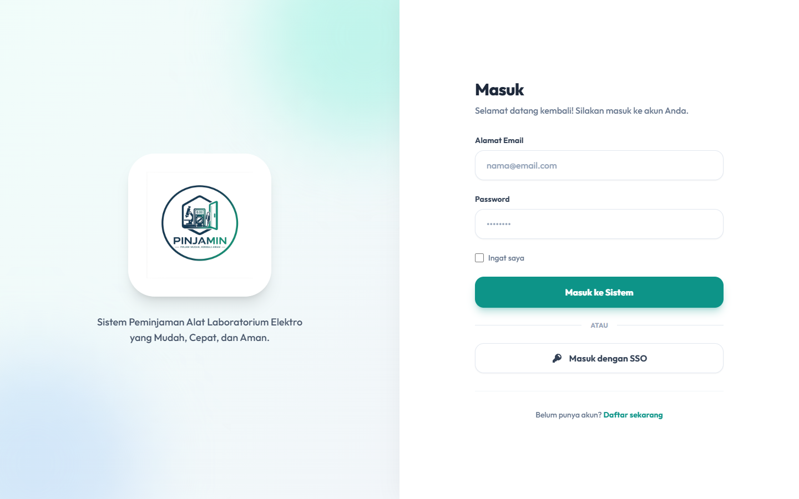
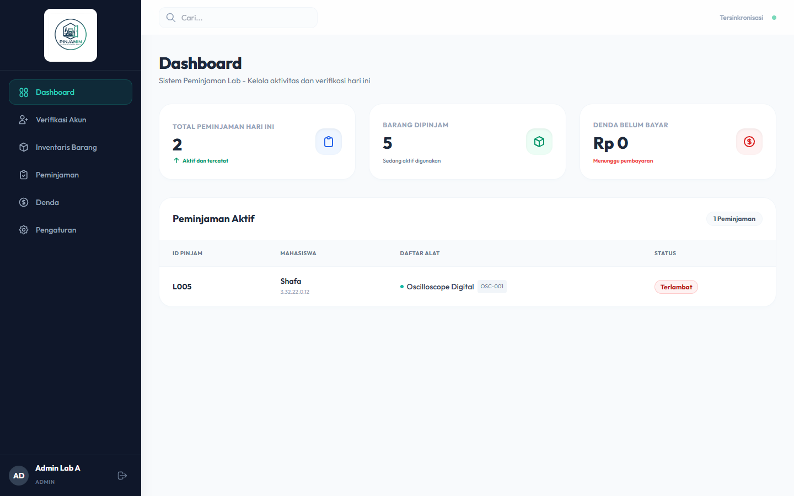
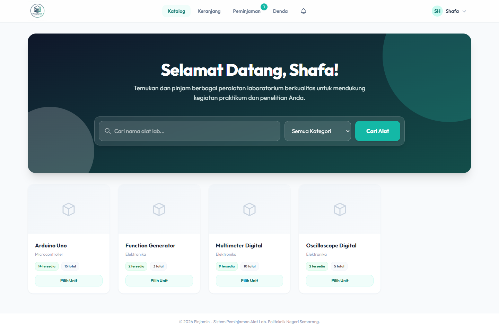
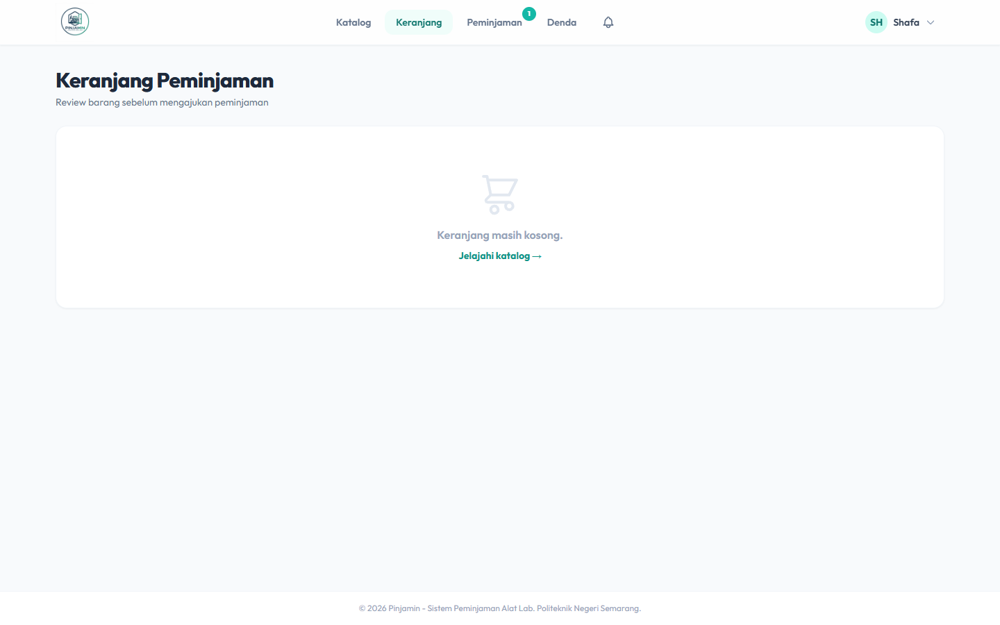
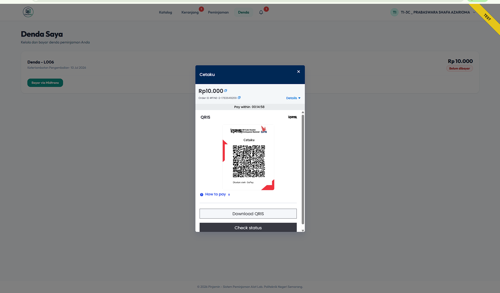
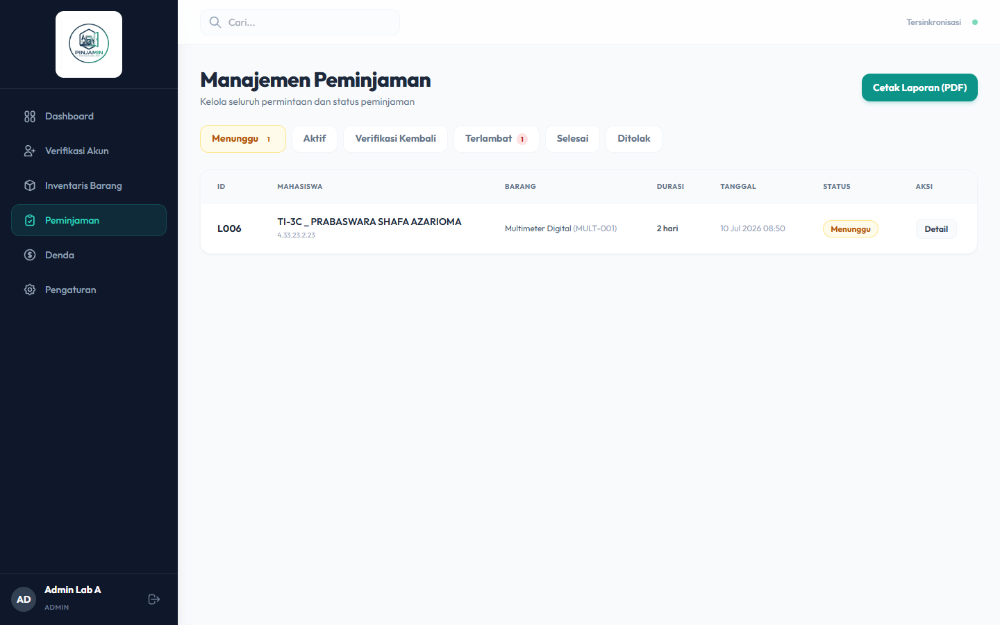

# 🚀 Pinjamin - Laboratory Equipment Loan System

<p align="center">
  
</p>

**Pinjamin** is a modern web application platform built to facilitate students and administrators in managing the borrowing process of laboratory practicum equipment (specifically for Semarang State Polytechnic / Polines). 

The application is built using **Laravel 11**, styled with a modern UI (Tailwind CSS + Alpine.js), and offers a lightning-fast navigation experience (*Single Page Application*) thanks to the integration of **Hotwire Turbo**.

---

## ✨ Key Features

### 👨‍🎓 For Students:
1. **Google Single Sign-On (SSO):** Instant login without the hassle of remembering passwords using Google accounts (restricted to the `@mhs.polines.ac.id` domain).
2. **Interactive Catalog:** Browse items, view real-time stock availability, and add items to the Cart just like an e-commerce platform.
3. **Turbo Navigation (SPA):** Seamless transitions between pages without reloading the entire page (no white screen flashes).
4. **Automated Fine Payment (Midtrans):** Fines for late returns or damaged items can be paid directly using QRIS, GoPay, or Bank Transfer through the integrated Midtrans Payment Gateway.
5. **Notifications & Status:** Monitor loan approval statuses, active borrow items, and return reminders.

### 👨‍💻 For Administrators:
1. **Statistics Dashboard:** Summary of active loans, overdue items, and a verification queue for new student registrations (ID/KTM).
2. **Inventory Management:** Detailed tracking of items and individual units (including serial numbers). Item availability status updates automatically upon lending.
3. **Approval Flow:** Single-click approval, rejection, and return verification.
4. **Smart Fine System:** Automatic calculation of late returns based on hourly or daily rates, with auto-generated billing sent directly to students.
5. **PDF Reports:** Export neat PDF reports of borrowing history with filterable status criteria.
6. **System Settings:** Dynamically configure fine amounts, maximum loan durations, and item borrow limits.

---

## 📸 Screenshots

| Login & SSO Page | Admin Dashboard |
| :---: | :---: |
|  |  |

| Student Catalog | Borrowing Cart |
| :---: | :---: |
|  |  |

| Midtrans Payment Integration | Loan Management (Admin) |
| :---: | :---: |
|  |  |

---

## 💻 Installation Guide (Development)

Here is a guide to run Pinjamin on your local machine (using **Laragon** or XAMPP).

### 1. System Requirements
- PHP >= 8.3
- Composer
- Node.js & NPM (for Tailwind & Vite)
- MySQL or SQLite Database

### 2. Clone the Repository
Open your terminal and run:
```bash
git clone https://github.com/ShafaAzahri/Pinjamin.git
cd Pinjamin
```

### 3. Install Dependencies (Backend & Frontend)
```bash
composer install
npm install
```

### 4. Configure `.env`
Copy the environment template file:
```bash
cp .env.example .env
```
Then, generate the application key:
```bash
php artisan key:generate
```

Configure your database and application URL in the `.env` file:
```env
APP_URL=http://pinjamin.test

# If using MySQL:
DB_CONNECTION=mysql
DB_HOST=127.0.0.1
DB_PORT=3306
DB_DATABASE=pinjamin
DB_USERNAME=root
DB_PASSWORD=

# Alternatively, if you want to use SQLite:
DB_CONNECTION=sqlite
```

### 5. Configure Google SSO (Required for Login)
To enable the *Login with Google* feature, add your credentials from the **Google Cloud Console** to your `.env` file:
```env
GOOGLE_CLIENT_ID=your_client_id_here
GOOGLE_CLIENT_SECRET=your_client_secret_here
GOOGLE_REDIRECT_URI=http://pinjamin.test/auth/google/callback
```

### 6. Database Migration & Seeders
Set up the tables and populate the default accounts (Admin & Student):
```bash
php artisan migrate:fresh --seed
```
*Note: This command will generate default admin credentials (admin@pinjamin.com / password) and a sample student account.*

### 7. Run Vite Development Server (For CSS & JS)
Open a new terminal tab and run:
```bash
npm run dev
```

All set! You can now access the application in your browser at:
`http://pinjamin.test/`

---

## 🛠 Technologies Used
- **Core Framework:** Laravel 11
- **UI & Styling:** Tailwind CSS 3
- **Interactivity:** Alpine.js
- **SPA Navigation:** Hotwire Turbo 8
- **PDF Generator:** Barryvdh/DomPDF
- **Payment Gateway:** Midtrans Snap
- **Authentication:** Laravel Sanctum (Core Auth) & Laravel Socialite (Google SSO)

---
*Created for Semarang State Polytechnic Project / Thesis.*
